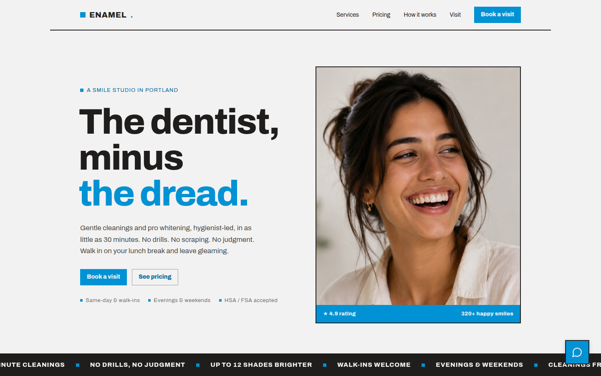
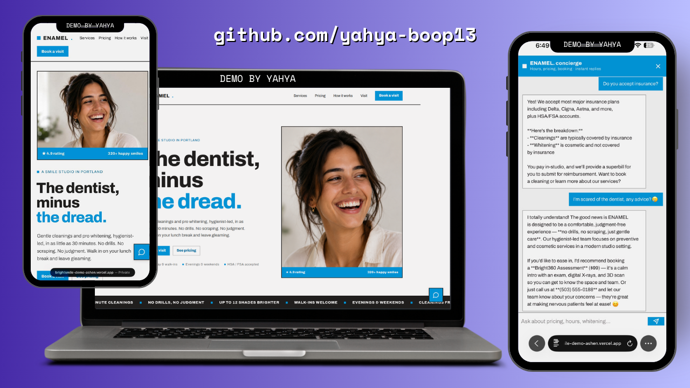

# ENAMEL — Smile Studio (Website + AI Concierge)

A modern, responsive marketing website for a boutique dental studio, with an **embedded AI chat concierge** that answers visitor questions (hours, pricing, services, insurance, booking) in real time.

Built as a portfolio demo that proves two things at once: a polished, high-design marketing site **and** a working, securely-built AI chatbot.

**Live demo:** https://brightsmile-demo-ashen.vercel.app/




## What it does
- A one-page site for a smile studio: hero, services, pricing, how-it-works, founder, testimonials, FAQ, and contact
- A floating **AI concierge** (bottom-right) that answers questions about the business using a knowledge base, with guardrails so it stays on-topic and never invents information
- Fully responsive and mobile-first, with an animated marquee and scroll-reveal animations

## How the AI concierge works (secure by design)
```
Browser  →  Next.js API route (/api/chat)  →  Anthropic API
```
The Anthropic API key lives **only** in a server-side environment variable and is never exposed to the browser. The system prompt holds the studio's knowledge base plus guardrails (stay on topic, never invent prices/hours, defer to a human when unsure).

## Tech stack
- **Next.js** (App Router) + **React** + **TypeScript**
- Custom CSS design system (Modernist / Swiss style)
- **Anthropic API** (Claude) called from a secure server route handler
- Deployed on **Vercel**

## Run it locally
```bash
npm install
# add your key to .env.local:
#   ANTHROPIC_API_KEY=sk-ant-...
npm run dev
```

---

*Fictional business — a portfolio demo built by Yahya.*
